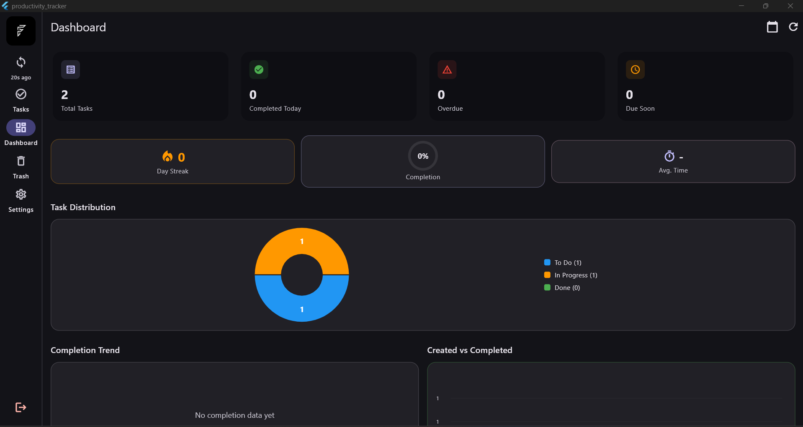

# FocusTrail

> A full-stack productivity tracking application with offline-first architecture


## 📋 Overview

FocusTrail is a modern task management and productivity tracking application designed to help you stay organized across all your devices. Built with offline-first architecture, it ensures your data is always available, even without an internet connection.

### Key Features

- ✅ **Task Management** - Create, edit, organize, and track tasks with priorities and due dates
- 📊 **Dashboard Analytics** - Visualize your productivity with interactive charts and statistics
- 🗑️ **Trash Bin** - Safely delete and restore tasks when needed
- 🔔 **Smart Reminders** - Get notified about upcoming and overdue tasks
- 📤 **Data Export** - Export your tasks in CSV or JSON format
- 🔄 **Offline-First Sync** - Work seamlessly offline with automatic background synchronization
- 🎨 **Modern UI** - Beautiful glassmorphism design with smooth animations
- 🔐 **Secure Authentication** - JWT-based authentication with "Remember Me" functionality
- 🌐 **Multi-Platform** - Mobile app (Flutter), Web extension (Chrome), and Backend API

## 🎥 Demo

### Mobile App


### Chrome Extension


### Dashboard Analytics


## 🏗️ Architecture

FocusTrail consists of three main components:

```
FocusTrail/
├── app/          # Flutter mobile application
├── extension/    # Chrome browser extension
└── server/       # Node.js REST API backend
```

### System Architecture

```
┌─────────────────┐         ┌─────────────────┐
│  Flutter App    │◄───────►│   REST API      │
│  (Mobile)       │         │   (Node.js)     │
└─────────────────┘         └─────────────────┘
                                     │
┌─────────────────┐                 │
│     Chrome      │◄────────────────┘
│   Extension     │         
└─────────────────┘         
                            ┌─────────────────┐
                            │    MongoDB      │
                            │   (Database)    │
                            └─────────────────┘
```

### Tech Stack

#### Mobile App (Flutter)
- **Framework**: Flutter 3.7.0+
- **State Management**: Riverpod 2.0+
- **Routing**: go_router
- **Local Storage**: Hive
- **HTTP Client**: Dio
- **Charts**: fl_chart
- **Architecture**: Clean Architecture with feature-based structure

#### Backend (Node.js)
- **Runtime**: Node.js 20+
- **Framework**: Express 5.2.1
- **Language**: TypeScript 5.9.3
- **Database**: MongoDB with Mongoose
- **Validation**: Zod
- **Authentication**: JWT
- **Testing**: Vitest
- **Documentation**: Swagger/OpenAPI

#### Chrome Extension
- **Manifest**: V3
- **UI**: Vanilla JavaScript
- **Storage**: Chrome Storage API
- **Styling**: Modern CSS with glassmorphism

## 🚀 Quick Start

### Prerequisites

- **Node.js**: 20+ ([Download](https://nodejs.org/))
- **Flutter**: 3.7.0+ ([Install Guide](https://docs.flutter.dev/get-started/install))
- **MongoDB**: 6.0+ ([Install Guide](https://www.mongodb.com/docs/manual/installation/))
- **Chrome Browser**: For extension development

### Installation

1. **Clone the repository**
   ```bash
   git clone https://github.com/yourusername/FocusTrail.git
   cd FocusTrail
   ```

2. **Set up the Backend**
   ```bash
   cd server
   npm install
   cp .env.example .env
   # Edit .env with your configuration
   npm run dev
   ```

3. **Set up the Mobile App**
   ```bash
   cd app
   flutter pub get
   flutter run
   ```

4. **Set up the Chrome Extension**
   ```bash
   cd extension
   # Edit config.js with your API URL
   # Load unpacked extension in Chrome
   ```

For detailed setup instructions, see the README files in each component directory.

## 📱 Features in Detail

### Task Management
- Create tasks with title, description, priority, and due dates
- Set task status: To Do, In Progress, Done
- Priority levels: Low, Medium, High
- Search and filter tasks by status, priority, or keyword
- Edit or delete tasks
- Move tasks to trash and restore them

### Dashboard & Analytics
- Total task count and completion rate
- Tasks by status breakdown
- Priority distribution chart
- Overdue task tracker
- Productivity streak counter
- Completion trend graphs
- Weekly/monthly analytics

### Offline-First Sync
- All operations work offline
- Changes queued automatically
- Background sync when online
- Conflict resolution
- Real-time sync indicator
- Optimistic UI updates

### Smart Reminders
- Set reminders for specific dates/times
- View upcoming reminders
- Get notifications for due tasks
- Snooze or dismiss reminders

### Data Export
- Export tasks as CSV for Excel
- Export tasks as JSON for backup
- Filter export by status or date range
- Maintain data portability

## 🔧 Configuration

### Backend Configuration
Edit `server/.env`:
```env
PORT=4000
MONGODB_URI=mongodb://localhost:27017/focustrail
JWT_SECRET=your-secret-key-here
JWT_EXPIRES_IN=7d
CORS_ORIGINS=http://localhost:3000
```

### Mobile App Configuration
Edit `app/lib/core/config/api_config.dart`:
```dart
static const String baseUrl = 'http://localhost:4000/api';
```

### Extension Configuration
Edit `extension/config.js`:
```javascript
const CONFIG = {
  API_BASE_URL: 'http://localhost:4000',
  LOG_LEVEL: 'info',
};
```

## 📚 API Documentation

The backend provides a comprehensive REST API documented with Swagger/OpenAPI.

**Access the API docs**: `http://localhost:4000/docs`

### Main Endpoints

#### Authentication
- `POST /api/auth/register` - Register new user
- `POST /api/auth/login` - Login user
- `GET /api/auth/me` - Get current user

#### Tasks
- `GET /api/tasks` - List all tasks
- `POST /api/tasks` - Create task
- `GET /api/tasks/:id` - Get task details
- `PATCH /api/tasks/:id` - Update task
- `DELETE /api/tasks/:id` - Delete task permanently
- `PATCH /api/tasks/:id/trash` - Move to trash
- `PATCH /api/tasks/:id/restore` - Restore from trash

#### Analytics
- `GET /api/tasks/stats` - Dashboard statistics
- `GET /api/tasks/analytics/completion` - Completion trend
- `GET /api/tasks/analytics/trend` - Created vs completed trend

For complete API documentation, refer to `server/src/docs/openapi.ts`

## 🧪 Testing

### Backend Tests
```bash
cd server
npm test                  # Run all tests
npm run test:watch        # Watch mode
npm run test:coverage     # Coverage report
```

### Mobile App Tests
```bash
cd app
flutter test              # Run unit tests
flutter test --coverage   # With coverage
```

## 📊 Project Structure

### Mobile App Structure
```
app/
├── lib/
│   ├── core/                 # Core utilities
│   │   ├── config/          # App configuration
│   │   ├── network/         # API client
│   │   └── utils/           # Helpers & logger
│   ├── features/            # Feature modules
│   │   ├── auth/            # Authentication
│   │   ├── tasks/           # Task management
│   │   ├── dashboard/       # Analytics
│   │   ├── trash/           # Trash bin
│   │   └── export/          # Data export
│   ├── main.dart            # App entry point
│   ├── app.dart             # App widget
│   └── router.dart          # Route configuration
└── test/                    # Tests
```

### Backend Structure
```
server/
├── src/
│   ├── config/              # Configuration
│   ├── middlewares/         # Express middlewares
│   ├── models/              # Mongoose models
│   ├── modules/             # Feature modules
│   │   ├── auth/           # Auth routes & logic
│   │   └── tasks/          # Task routes & logic
│   ├── utils/              # Utilities
│   ├── docs/               # API documentation
│   ├── app.ts              # Express app setup
│   └── server.ts           # Server entry point
└── tests/                   # Test files
```

### Extension Structure
```
extension/
├── icons/                   # Extension icons
├── config.js               # Configuration
├── logger.js               # Logging utility
├── popup.html              # Extension UI
├── popup.css               # Styles
├── popup.js                # Logic & API client
└── manifest.json           # Extension manifest
```

## 🤝 Contributing

We welcome contributions! Please follow these steps:

1. Fork the repository
2. Create a feature branch (`git checkout -b feature/amazing-feature`)
3. Commit your changes (`git commit -m 'Add amazing feature'`)
4. Push to the branch (`git push origin feature/amazing-feature`)
5. Open a Pull Request

### Development Guidelines

- Follow the existing code style
- Write tests for new features
- Update documentation as needed
- Ensure all tests pass before submitting PR
- Keep commits atomic and well-described

## 🐛 Known Issues

- [ ] Mobile app: Background sync on iOS requires additional testing
- [ ] Extension: Notification API not yet implemented
- [ ] Server: Rate limiting needs enhancement for production

## 🗺️ Roadmap

### Version 2.0
- [ ] Real-time collaboration features
- [ ] Team workspaces
- [ ] Task templates
- [ ] Recurring tasks
- [ ] Calendar integration
- [ ] Desktop app (Electron)

### Version 2.1
- [ ] AI-powered task suggestions
- [ ] Voice input for tasks
- [ ] Dark/Light theme toggle
- [ ] Multiple language support
- [ ] Pomodoro timer integration

## 📄 License

This project is licensed under the MIT License - see the [LICENSE](LICENSE) file for details.

## 👥 Authors

- **Your Name** - *Initial work* - [YourGitHub](https://github.com/yourusername)

## 🙏 Acknowledgments

- Flutter team for the amazing framework
- Express.js community
- All open-source contributors whose packages made this possible

## 📞 Support

For support, email support@focustrail.com or open an issue in the GitHub repository.

## 🔗 Links

- [Documentation](https://docs.focustrail.com)
- [Website](https://focustrail.com)
- [Bug Reports](https://github.com/yourusername/FocusTrail/issues)
- [Feature Requests](https://github.com/yourusername/FocusTrail/issues)

---

**Built with ❤️ using Flutter, Node.js, and MongoDB**
